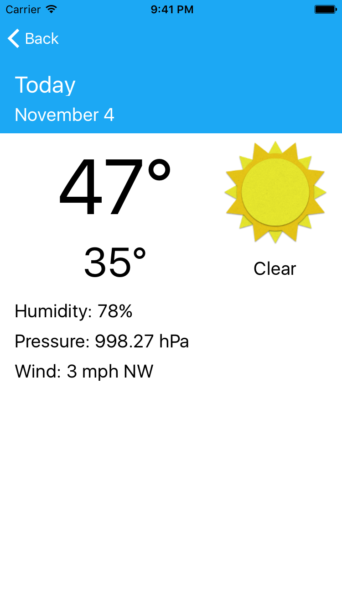

# Sunshine
Sunshine is an iOS implementation of the Sunshine application developed in Udacity's "Developing Android Apps: Android Fundamentals" course. This project was started as an experiment to compare iOS and Android applications.

Android Sunshine Source Code: https://github.com/udacity/Sunshine-Version-2

<ul>
<lh>Sunshine for iOS requires the following:</lh>
<li>Xcode 8 with Swift 3</li>
<li>An API key for <a href="https://openweathermap.org/api">OpenWeatherMap</a>. Copy your API key into the OpenWeatherConstants.swift file.</li>
</ul>

